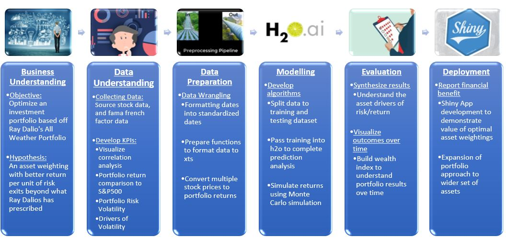
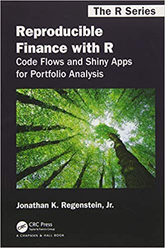

\newpage
\tableofcontents 
\newpage

```{r setup, include=FALSE}
knitr::opts_chunk$set(echo = TRUE,
                      fig.align = "center",
                        message = FALSE,
                      warning = FALSE)
options(tinytex.verbose = TRUE)
```


```{r, echo = FALSE}
setwd("C:/Users/steph/Dropbox/Business University Science/Personal Portfolio/Part 2 Draft/All-Seasons-Fund-Part-2")
if(!require(pacman)) install.packages("pacman")
pacman::p_load("tidyquant",
               "tidyr",
               "furrr", 
               "plotly",
               "tibble",
               "dplyr",
               "highcharter",
               "purrr",
               "correlationfunnel",
               "dplyr",
               "glue",
               "tibble")
```

# All Seasons Portfolio Part 2

My third post to connect my learnings with my personal passion.


# Business Science Problem Framework (BSPF)

- With the increasing array of tools, I was swept away into some meaningless directions between advanced algorithms and other statistics. Therefofare I sat myself down to use a streamlined framework called the BSPF to re-orient myself. The BSPF is a systematic process to apply data science to business built on the learnings of Ray Dalio's philosophies in the book, Principles and Crisp DM

1. How To Successfully Manage A Data Science Project: The Business Science Problem Framework from Matt Dancho's Business Science University (https://www.business-science.io/business/2018/06/19/business-science-problem-framework.html)
```{r, out.width = "500px", echo = FALSE}
#PICTURES: Showcasing the picture of the book and the course

```

\newpage

2. Principles by Ray Dalio (https://www.principles.com/)

```{r, out.width = "150px", echo = FALSE}

#PICTURES: Showcasing the picture of the book and the course


```


3. Reading the wealth of articles on Reproducible Finance with R: Code Flows and Shiny Apps for Portfolio Analysis by Jonathan K. Regenstein (http://www.reproduciblefinance.com/)
```{r, out.width = "150px", echo = FALSE}

#PICTURES: Showcasing the picture of the book and the course


```

_Credits go to both Matt Dancho and Jonathan K Regenstein in making this post possible. Matt for educating me and creating the tidyquant package and Jonathan for putting together a book for beginners._

# Business Understanding

## Developing a Portfolio based on Ray Dalio's All Weather Fund

In Tony Robbin's book - Master the Game, I learned about the All Weather Fund and more about personal investing for the general public. Since then I decided to complete a deeper dive on this portfolio and the different asset classes to determine if data science can help me to unlock some more financial benefits. 

__Objective and Key Result__

- __Objective:__ Optimize an investment portfolio based on Ray Dalio's All Weather Fund

- __Hypothesis and Key Result:__ An asset weighting with better return per unit of risk exists beyond what Ray Dalio has prescribed  


## Breakdown of All Weather Fund

1. 40% Long Term Bonds (TLT)
2. 30% Stocks (VTI)
3. 15% Intermediate Term Bonds (IEF)
4. 7.5% Gold (GLD)
5. 7.5% Commodities (DBC)

```{r, echo = FALSE}
#3.0 BUILDING A PORTFOLIO ----
w <- c(0.3,
       0.4,
       0.15,
       0.075,
       0.075)
symbols <- c("VTI", "TLT", "IEF", "GLD", "DBC")
wts_tbl <- tibble(symbols, w)


wts_tbl %>%
    ggplot(aes(x = "", y = w, fill = symbols)) +
    geom_bar(width = 1, stat = "identity") +
    coord_polar("y", start = 0) +
    theme(axis.text.x = element_blank()) +
    geom_text(label = scales::percent(w), position = position_stack(vjust = 0.5)) +
    scale_fill_tq() +
    labs(x = "", y = "", fill = "",
         title = "Asset weights in portfolio"
         # caption = "Ray Dalio's All Weather Fund"
         )
```


# My Workflow

Here's a breakdown of the workflow I used to create the All Seasons Portfolio:

1. __Collecting Data:__ Source a reproducible function to import, transform and build a stock portfolio using tidyquant package. Create a second function to pull fama french factors.

2. __Visualize Data:__ Visualize the data to understand the correlation of Fama French Factors to portfolio

3. __Volatility of Portfolio:__ Chart the comparison of asset and portfolio standard deviation comparison

4. __Modelling:__ Forecast the Portfolio returns with machine learning using h2o package

[UPDATE]5. Visualize the investment growth of the portfolio based on a $10,000 investment

# Walk through - Building the All Weather Fund portfolio with tidyquant

## Import Data

Tq_get will grab the 5 years of daily stock prices from Yahoo Finance and convert to monthly returns

```{r, echo = TRUE}
# 1.0 IMPORT DATA ----

symbols <- c("VTI", "TLT", "IEF", "GLD", "DBC")
end     <- "2019-11-30" %>% ymd()
start   <- end - years(5) + days(1)
w <- c(0.3,
       0.4,
       0.15,
       0.075,
       0.075)
wts_tbl <- tibble(symbols, w)
source(file = "00_Scripts/portfolio_multi_period_data.R")
source(file = "00_Scripts/import_FF.R")

# All seasons data and portfolio
portfolio_training_data <- portfolio_multi_period_data(symbols, end, start, wts_tbl, 
                                                       period = "monthly")
all_seasons_asset <- individual_asset_multi_period_data(symbols, end, start, 
                                                        period = "monthly")
returns_port_tbl <- portfolio_training_data %>%
    rbind(all_seasons_asset) %>%
    mutate(symbol = str_replace_all(symbol, c("VTI" = "Stocks",
                                    "TLT" = "Long Term Bonds",
                                    "IEF" = "Medium Term Bonds",
                                    "GLD" = "Gold",
                                    "DBC" = "Commodities")))

returns_port_tbl %>%
    pivot_wider(names_from = symbol, values_from = monthly.returns)

```

# Visualizing Results

__What is Fama French Factors?__
A brief explanation of the fama french factors is that it extends the capital asset pricing model (CAPM) by adding in multiple variables including market, size, value, investment and profitability. While there is some debate over whether the Three-Factor Model or the Five-Factor Model is better, for the purposes of putting into the machine learning model I have used the Five-Factor Model. You will see several abbreviations being used and here is the explanation for them:

- __MKT:__ Return spread between capitalization weighted stock and cash

- __SMB:__ Return spread of small minus large stocks (ie. size effect)

- __HML:__ Return spread of cheap minus expensive stocks (ie. value effect)

- __RMW:__ Return spread of the most proftiable minus the lease profitable (ie. profitability effect)

- __CMA:__ Return spread of firms that invest conservatively minus aggressively (ie. investment effect)

## Correlation Analysis to Fama French Factors {.tabset .tabset-face .tabset-pills}

### Correlation Funnel to Fama French 5 Factor

Exploratory Data Analysis (EDA) which is usually a labour intensive. With this, I viewed the Correlation funnel as an essential to EDA as it streamlines the EDA process to prepare, process and visualize a correlation analysis. If there were more factors, the visualization will look like the shape of a funnel.
In the following Correlation Funnel, what's interesting to note is that Ray Dalio's All Weather Fund leans more toward profitability factor and market factor.
As a test, I also performed a linear regression on the factors and the results looked fairly similar.

```{r, echo = TRUE}
# 4.0 Correlation funnel -----
link_5_FF = "https://mba.tuck.dartmouth.edu/pages/faculty/ken.french/ftp/Developed_5_Factors_CSV.zip"
# link_5_FF = "https://mba.tuck.dartmouth.edu/pages/faculty/ken.french/ftp/Global_5_Factors_CSV.zip"
file_name_5_FF = "Developed_5_Factors.csv"
Global_5_Factors <- import_5_FF(link_5_FF, file_name_5_FF, returns_port_tbl)

Port_FF_5_tbl <- returns_port_tbl %>%
    filter(symbol == "Portfolio") %>% # new addition 01.03.2020
    rename(Portfolio = monthly.returns) %>%
    select(-symbol) %>%
    left_join(Global_5_Factors, by="date")

returns_correlation_funnel <- Port_FF_5_tbl %>%
    select(-date) %>%
    na.omit() %>%
    correlate(Portfolio) %>%
    filter(!(feature == "Portfolio")) %>%
    mutate(correlation = round(correlation, 2))

# Plot
returns_correlation_funnel %>%
    filter(!(feature == "RF")) %>%
    plot_correlation_funnel(interactive = FALSE) +
    geom_label(aes(label = correlation %>% scales::percent()), hjust = "outward", size = 8) +
    geom_segment(aes(x = correlation, y = feature, xend = 0, yend = feature)) +
    labs(title = "Correlation Funnel of Portfolio with Pearson Method",
         subtitle = "Strong correlation with profitability (RMW), market value (MKT) 
         and negative correlation with value (HML)",
         caption = "Ray Dalio's All Weather Fund",
         x = "Correlation",
         y = "Fama French factors")
```


### Correlation to Fama French 5 Factor
```{r}
## Fama French 5 Factor
# Name the variables
link_5_FF = "https://mba.tuck.dartmouth.edu/pages/faculty/ken.french/ftp/Developed_5_Factors_CSV.zip"
# link_5_FF = "https://mba.tuck.dartmouth.edu/pages/faculty/ken.french/ftp/Global_5_Factors_CSV.zip"
file_name_5_FF = "Developed_5_Factors.csv"
# file_name_5_FF = "Global_5_Factors.csv"
returns_tbl = returns_port_tbl
index_monthly_returns = portfolio_training_data

# Plot
import_5_FF(link_5_FF, file_name_5_FF, returns_port_tbl) %>%
    fama_french_lm(index_monthly_returns, returns_tbl) %>%
    filter(factor != "(Intercept)") %>%
    ggplot(aes(factor,
               y = beta,
               color = factor)) +
    geom_point(aes(size = 2)) +
    geom_errorbar(aes(ymin = conf.low,
                      ymax = conf.high)) +
    labs(title = "Fama French 5-Factor Betas with 95% Confidence Interval",
         caption = "Ray Dalio's All Weather Portfolio",
         subtitle = "Positive betas on profitability (RMW), market value (MKT),  
         investment (CMA) and size (SMB)  
         Negative relationship with value (HML)",
         x = "Factor",
         y = "Beta") +
    theme_tq() +
    scale_color_tq() +
    geom_text(aes(label = beta_text), hjust = -0.3)
```

\newpage

### Correlation to Fama French 3 Factor
```{r}
## Fama French 3 Factor
# Name the variables
link_3_FF = "https://mba.tuck.dartmouth.edu/pages/faculty/ken.french/ftp/Developed_3_Factors_CSV.zip"
file_name_3_FF = "Developed_3_Factors.csv"

# Plot
import_3_FF(link_3_FF, file_name_3_FF, returns_port_tbl) %>%
    filter(factor != "(Intercept)") %>%
    ggplot(aes(factor,
               y = beta,
               color = factor)) +
    geom_point(aes(size = 2)) +
    geom_errorbar(aes(ymin = conf.low,
                      ymax = conf.high)) +
    labs(title = "Fama French 3-Factor Betas with 95% Confidence Interval",
         caption = "Ray Dalio's All Weather Portfolio",
         subtitle = "Positive betas on market value (MKT)  
         Negative betas on value (HML) and size (SMB)",
         x = "Factor",
         y = "Beta") +
    theme_tq() +
    scale_color_tq() +
    geom_text(aes(label = beta_text), hjust = -0.3)
```


# Portfolio Volatiity

## Asset and Portfolio Standard Deviation Comparison
In the following visualization, Ray Dalio's multi-asset portfolio has lower volatility than the individual indexes.
As an experiment, I pulled in the S&P500 as a comparison to the portfolio volatility.

```{r}
# 5.0 Portfolio Standard Deviation ----
asset_returns_wide <- returns_port_tbl %>%
    filter(symbol != "Portfolio") %>%
    pivot_wider(names_from = "symbol", values_from= "monthly.returns") %>%
    # convert to xts function
    timetk::tk_xts(date_var = date)

# 5.1 Portfolio std deviation is 2.05%. Our potfolio has lower volatility
port_std_dev <- asset_returns_wide %>%
    StdDev(weights = w) %>%
    round(.,4) * 100

asset_names <- names(asset_returns_wide)

# 5.2 Asset std deviation is 2-5%


SP500_tbl <- individual_asset_multi_period_data("SPY", end, start, period = "monthly") %>%
    add_column(symbol = "S&P500") %>%
    select(symbol, everything())

asset_std_dev <- returns_port_tbl %>%
    filter(symbol != "Portfolio") %>%
    rbind(SP500_tbl) %>%
    pivot_wider(names_from = "symbol", values_from= "monthly.returns") %>%
    select(-date) %>%
    map_df(~ StdDev(.)) %>%
    round(.,4) *100

std_dev_comparison_tbl <- tibble(Name = c("Portfolio", asset_names, "SP500"),
       Std_Dev = c(port_std_dev, asset_std_dev)) %>%
    unnest() %>%
    mutate(Std_Dev = Std_Dev/100)

std_dev_comparison_tbl %>%
    ggplot(aes(Name, Std_Dev))+
    geom_point() +
    theme_tq() +
    scale_y_continuous(labels = scales::percent) +
    geom_label(aes(label = scales::percent(round(Std_Dev,5))), hjust = "inward")+
    labs(title = "Asset and Portfolio Standard Deviation Comparison",
         caption = "Ray Dalio's All Weather Portfolio",
         subtitle = "Portfolio Standard Deviation is 1.76%",
         x = "",
         y = "Standard Deviation") +
    geom_label(data = std_dev_comparison_tbl, aes(x = "Portfolio",
             y = 0.02,
             label = "Portfolio Standard Deviation"),
             color = palette_light()[[2]],
             fontface = "bold") +
  theme(axis.text.x = element_text(angle = 70, hjust = 1)) ##Update

```


# Modelling with h2o

## Time Series Forecasting with Machine Learning

Initializing h2o to start my machine learning (ML) journey. The h2o package has been an essential in enabling a range of functions from deploying multiple types of ML algorithms, performance metrics and auxiliary functions to make it easy and powerful.

To forecast the portfolio returns, I've used the h2o.autoML() to prescribe time series machine learning to forecast time series data. In this analysis, I have used 4 years of data as a training set and 2019 data as the testing set.

```{r}
# Plot to identify validation and test sets
Port_FF_5_tbl %>%
    ggplot(aes(date, Portfolio)) +
    annotate("text", x = ymd("2016-01-01"), y = -0.034,
             color = palette_light()[[1]], label = "Train Region") +
    # # Validation Square
    # geom_rect(xmin = as.numeric(ymd("2018-01-01")),
    #           xmax = as.numeric(ymd("2019-01-01")),
    #           ymin = -Inf, ymax = Inf, alpha = 0.02,
    #           fill = palette_light()[[3]]) +
    # annotate("text", x = ymd("2018-06-01"), y = -0.034,
    #          color = palette_light()[[1]], label = "Validation\nRegion") +
    #Test Square
    geom_rect(xmin = as.numeric(ymd("2019-01-01")),
              xmax = as.numeric(ymd("2019-11-01")),
              ymin = -Inf, ymax = Inf, alpha = 0.02,
              fill = palette_light()[[3]]) +
    annotate("text", x = ymd("2019-06-01"), y = -0.034,
             color = palette_light()[[1]], label = "Test\nRegion") +
    geom_line(col = palette_light()[[1]]) +
    geom_point(col = palette_light()[[1]]) +
    geom_ma(ma_fun = SMA, n = 12, size = 1) +
    theme_tq() +
    scale_x_date(date_breaks = "1 year", date_labels = "%Y") +
    scale_y_continuous(labels = scales::percent_format())+
    labs(title = "Portfolio Returns: 2015 through 2019",
         subtitle = "Train, and Test Sets Shown",
         caption = "Ray Dalio's All Weather Funds",
         y = "Portfolio Returns", x = "Date")

```


To compare, I've calculated a few residual metrics. These metrics help to evaluate how the accuracy of the model on the testing dataset.
Typically, MAPE is the more reliable metric however it does not perform well when the metrics are low (ie. percentage returns). This causes MAPE to be very high. As a result, the more reliable measure to use is Mean Absolute Error (MAE).

<!-- ```{r, include = FALSE} -->
<!-- # 6.0 Modelling ---- -->
<!-- # Start up h2o -->
<!-- h2o.init() -->
<!-- ``` -->


<!-- ```{r} -->
<!-- h2o.no_progress() -->

<!-- portfolio_return_tbl_clean <- Port_FF_5_tbl %>% -->
<!--     na.omit() %>% -->
<!--     tk_augment_timeseries_signature() %>% -->
<!--     select_if(~ !is.Date(.)) %>% -->
<!--     select_if(~ !any(is.na(.))) %>% -->
<!--     mutate_if(is.ordered, ~as.character(.) %>% as.factor) -->

<!-- train_tbl <- portfolio_return_tbl_clean %>% filter(year< 2019) -->
<!-- train_tbl_h2o <- as.h2o(train_tbl) -->

<!-- test_tbl <- portfolio_return_tbl_clean %>% filter(year == 2019) -->
<!-- test_tbl_h2o <- as.h2o(test_tbl) -->

<!-- y <- "Portfolio" -->
<!-- x <- setdiff(names(train_tbl_h2o), y) -->

<!-- portfolio_automl_models_h2o <- h2o.automl( -->
<!--     x = x, -->
<!--     y =y, -->
<!--     training_frame = train_tbl_h2o, -->
<!--     max_runtime_secs = 60, -->
<!--     stopping_metric = "deviance") -->

<!-- automl_leader <- portfolio_automl_models_h2o@leader -->
<!-- automl_leader_name <- portfolio_automl_models_h2o@leaderboard %>% -->
<!--     as_tibble() %>% -->
<!--     mutate(model_type = str_split(model_id, pattern = "_", simplify = TRUE)[,1], -->
<!--            model_name = glue::glue("{model_type} Model") %>% as.character()) %>% -->
<!--     slice(1) %>% -->
<!--     pull(model_name) -->
<!-- prediction_h2o_leader <- h2o.predict(automl_leader, newdata = test_tbl_h2o) -->

<!-- error_tbl <- Port_FF_5_tbl %>% -->
<!--     filter(lubridate::year(date) == 2019) %>% -->
<!--     na.omit() %>% -->
<!--     add_column(pred = prediction_h2o_leader %>% as.tibble() %>% pull(predict)) %>% -->
<!--     rename(actual = Portfolio) %>% -->
<!--     mutate( -->
<!--         error = actual - pred, -->
<!--         error_pct = error/actual -->
<!--     ) -->
<!-- error_tbl %>% -->
<!--     summarize( -->
<!--         me = mean(error), -->
<!--         rmse = mean(error^2)^0.5, -->
<!--         mae = mean(abs(error)), -->
<!--         mape = mean(abs(error_pct)), -->
<!--         mpe = mean(error_pct) -->
<!--     ) -->


<!-- ``` -->

<!-- The following is a visualization after applying three different models on the testing dataset to compare with the actual returns of the portfolio (in this case 3 GBMs). Although the forecast is still in its infancy, there are opportunities to improve. -->


<!-- ```{r} -->
<!-- source("00_Scripts/prediction_error_tbl.R") -->

<!-- # Reproducibility prediction based on leaderboard models -->
<!-- model_1 <- prediction_error_tbl(Portfolio_tbl = Port_FF_5_tbl, -->
<!--                                                 h2o_leaderboard = portfolio_automl_models_h2o, -->
<!--                                                 n = 1, -->
<!--                                                 test_tbl = test_tbl_h2o) -->
<!-- model_2 <- prediction_error_tbl(Portfolio_tbl = Port_FF_5_tbl, -->
<!--                                                  h2o_leaderboard = portfolio_automl_models_h2o, -->
<!--                                                  n = 2, -->
<!--                                                  test_tbl = test_tbl_h2o) -->
<!-- model_3 <- prediction_error_tbl(Portfolio_tbl = Port_FF_5_tbl, -->
<!--                                                          h2o_leaderboard = portfolio_automl_models_h2o, -->
<!--                                                          n = 3, -->
<!--                                                          test_tbl = test_tbl_h2o) -->
<!-- # Plot -->
<!-- #Spooky theme -->

<!-- p_load("extrafont") -->
<!-- library(extrafont) -->
<!-- loadfonts(device="win") -->
<!-- theme_spooky = function(base_size = 10, base_family = "Chiller") { -->

<!--     theme_grey(base_size = base_size, base_family = base_family) %+replace% -->

<!--         theme( -->
<!--             # Specify axis options -->
<!--             axis.line = element_blank(), -->
<!--             axis.text.x = element_text(size = base_size*0.8, color = "white", lineheight = 0.9), -->
<!--             axis.text.y = element_text(size = base_size*0.8, color = "white", lineheight = 0.9), -->
<!--             axis.ticks = element_line(color = "white", size  =  0.2), -->
<!--             axis.title.x = element_text(size = base_size, color = "white", margin = margin(0, 10, 0, 0)), -->
<!--             axis.title.y = element_text(size = base_size, color = "white", angle = 90, margin = margin(0, 10, 0, 0)), -->
<!--             axis.ticks.length = unit(0.3, "lines"), -->
<!--             # Specify legend options -->
<!--             legend.background = element_rect(color = NA, fill = " gray10"), -->
<!--             legend.key = element_rect(color = "white",  fill = " gray10"), -->
<!--             legend.key.size = unit(1.2, "lines"), -->
<!--             legend.key.height = NULL, -->
<!--             legend.key.width = NULL, -->
<!--             legend.text = element_text(size = base_size*0.8, color = "white"), -->
<!--             legend.title = element_text(size = base_size*0.8, face = "bold", hjust = 0, color = "white"), -->
<!--             legend.position = "none", -->
<!--             legend.text.align = NULL, -->
<!--             legend.title.align = NULL, -->
<!--             legend.direction = "vertical", -->
<!--             legend.box = NULL, -->
<!--             # Specify panel options -->
<!--             panel.background = element_rect(fill = " gray10", color  =  NA), -->
<!--             #panel.border = element_rect(fill = NA, color = "white"), -->
<!--             panel.border = element_blank(), -->
<!--             panel.grid.major = element_line(color = "grey35"), -->
<!--             panel.grid.minor = element_line(color = "grey20"), -->
<!--             panel.spacing = unit(0.5, "lines"), -->
<!--             # Specify facetting options -->
<!--             strip.background = element_rect(fill = "grey30", color = "grey10"), -->
<!--             strip.text.x = element_text(size = base_size*0.8, color = "white"), -->
<!--             strip.text.y = element_text(size = base_size*0.8, color = "white",angle = -90), -->
<!--             # Specify plot options -->
<!--             plot.background = element_rect(color = " gray10", fill = " gray10"), -->
<!--             plot.title = element_text(size = base_size*1.2, color = "white",hjust=0,lineheight=1.25, -->
<!--                                       margin=margin(2,2,2,2)), -->
<!--             plot.subtitle = element_text(size = base_size*1, color = "white",hjust=0,  margin=margin(2,2,2,2)), -->
<!--             plot.caption = element_text(size = base_size*0.8, color = "white",hjust=0), -->
<!--             plot.margin = unit(rep(1, 4), "lines") -->

<!--         ) -->

<!-- } -->

<!-- Port_FF_5_tbl %>% -->
<!--     na.omit() %>% -->
<!--     # filter(lubridate::year(date) >= 2018) %>% -->
<!--     ggplot(aes(date, Portfolio)) + -->
<!--     geom_point(size = 2, color = "gray", alpha = 0.5, shape = 21, fill = "orange") + -->
<!--     geom_line(color = "orange", size = 0.5) + -->
<!--     geom_ma(n = 12, color = "white") + -->
<!--     # Predictions - Spooky Purple (Model 1) -->
<!--     geom_point(aes(y = pred), size = 2, color = "gray", alpha = 1, shape = 21, fill = "purple", data = model_1) + -->
<!--     geom_line(aes(y = pred), color = "purple", size = 0.5, data = model_1) + -->
<!--     # Predictions - Spooky Purple (Model 2) -->
<!--     geom_point(aes(y = pred), size = 2, color = "gray", alpha = 1, shape = 21, fill = palette_light()[[2]], data = model_2) + -->
<!--     geom_line(aes(y = pred), color = palette_light()[[2]], size = 0.5, data = model_2) + -->
<!--     # Predictions - Spooky Purple (Model 3) -->
<!--     geom_point(aes(y = pred), size = 2, color = "gray", alpha = 1, shape = 21, fill = palette_light()[[3]], data = model_3) + -->
<!--     geom_line(aes(y = pred), color = palette_light()[[3]], size = 0.5, data = model_3) + -->
<!--     # Aesthetics -->
<!--     theme_spooky(base_size = 20, base_family = "Chiller") + -->
<!--     annotate("text", x = ymd("2019-05-01"), y = -0.015, -->
<!--              color = "purple", label = pull_model_name(h2o_leaderboard = portfolio_automl_models_h2o, -->
<!--                                                        n = 1)) + -->
<!--     annotate("text", x = ymd("2019-02-01"), y = 0.04000, -->
<!--              color = palette_light()[[2]], label = pull_model_name(h2o_leaderboard = portfolio_automl_models_h2o, -->
<!--                                                                    n = 2)) + -->
<!--     annotate("text", x = ymd("2019-09-01"), y = -0.030, -->
<!--              color = palette_light()[[3]], label = pull_model_name(h2o_leaderboard = portfolio_automl_models_h2o, -->
<!--                                                        n = 3)) + -->
<!--     scale_x_date(date_breaks = "1 year", date_labels = "%Y") + -->
<!--     scale_y_continuous(labels = scales::percent_format())+ -->
<!--     labs(title = "Forecast of Portfolio Returns: 2019", -->
<!--          subtitle = "MAE = 1.39%", -->
<!--          caption = "Ray Dalio's All Weather Portfolio", -->
<!--          y = "Portfolio Returns", x = "Date") -->
<!-- ``` -->


<!-- ## h2o leaderboard metrics {.tabset .tabset-face .tabset-pills} -->

<!-- I have created a reproducible function to evaluate the top N models based on a metric. Since this is a regression analysis, the available metrics are mae, mean_residual_variance, rmse, rmse and rmsle.  -->
<!-- In the following examples, I share three visualizations based on the order by mean_residual_variance, by RMSE and by MAE. The order doesn't really change except at MAE.  -->

<!-- ### Leaderboard metrics by mean_residual_deviance -->

<!-- ```{r, out.width = "1000px"} -->
<!-- source(file = "00_Scripts/plot_FF_leaderboard.R") -->

<!-- portfolio_automl_models_h2o@leaderboard %>%  -->
<!--     plot_FF_leaderboard(order_by = "mean", n_max = 5, pretty_breaks = 2, size = 2) -->

<!-- ``` -->


<!-- ### Leaderboard metrics by RMSE -->

<!-- ```{r, out.width = "1000px"} -->
<!-- portfolio_automl_models_h2o@leaderboard %>%  -->
<!--     plot_FF_leaderboard(order_by = "rmse", n_max = 5, pretty_breaks = 2, size = 2) -->
<!-- ``` -->

<!-- ### Leaderboard metrics by MAE -->

<!-- ```{r, out.width = "1000px"} -->
<!-- portfolio_automl_models_h2o@leaderboard %>%  -->
<!--     plot_FF_leaderboard(order_by = "mae", n_max = 5, pretty_breaks = 2, size = 2) -->
<!-- ``` -->


<!-- # Hyper Parameter Tuning -->

<!-- ## Tuning of DeepLearning h2o model -->

<!-- Within the deeplearning model, there are a number of hyper parameters available to be tuned including but not limited to hidden and epochs. By running h2o_model@all_parameters, you can identify all the parameters associated with the model.  -->

<!-- In the following analysis, multiple deep learning models were generated based on my experimentation of several different parameters. The conclusion was the deep_learning model 9 had the best MAE. However this MAE still fell short of the MAE generated from the GBM models.  -->


<!-- ```{r} -->
<!-- # deeplearning_grid_01 <- h2o.grid( -->
<!-- #     algorithm = "deeplearning", -->
<!-- #     x = x, -->
<!-- #     y = y, -->
<!-- #     grid_id = "deeplearning_grid_01", -->
<!-- #     training_frame = train_tbl_h2o, -->
<!-- #     # validation_frame = F, -->
<!-- #     nfolds = 5, -->
<!-- #      -->
<!-- #     hyper_params = list( -->
<!-- #         hidden = list(c(10, 10, 10), c(50, 20, 10), c(20, 20, 20)), -->
<!-- #         epochs = c(5, 10, 20)  #allow to generalize to new data -->
<!-- #     ) -->
<!-- # ) -->
<!-- #  -->
<!-- # h2o.getGrid(grid_id = "deeplearning_grid_01", sort_by = "mae", decreasing = FALSE) -->
<!-- ``` -->

<!-- ```{r} -->
<!-- h2o.getModel("deeplearning_grid_01_model_9") %>% h2o.performance(newdata = as.h2o(test_tbl_h2o)) -->
<!-- ``` -->


<!-- # Parting Thoughts -->
<!-- Visualizing the forecasts and seeing myself inch closer was the most fulfilling accomplishment. Forecasting may seem simple but it ain't easy - it took me numerous days to figure out what machine learning really is and how to apply it to my problem - h2o automl is really the live saver. -->

<!-- _"Success is a journey, not a destination. The doing is often more important than the outcome"_ - Arthur Ashe  -->

<!-- It was really exciting to see the illustrations and analysis I could make from what I have learned so far in. I plan on writing a Part 3 to this post as I dig deeper into this portfolio by solving an optimization problem to determine the perfect asset weights.  -->

<!-- - Monte Carlo Simulation to simulate portfolio returns based on different asset weightings  -->

<!-- - Building a flex dashboard and integrating with shiny for user inputs to create different portfolio combinations -->

<!-- If you want to learn more, I am currently in a four part course learning Data Science for Business. I have completed Business Science 201 course and close to completion of the Business Science 102 course.  -->

